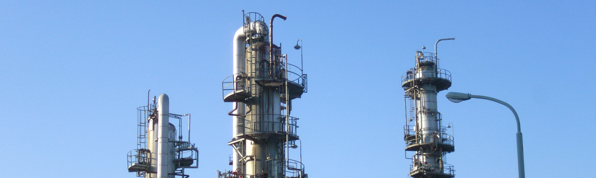

# BINARY DISTILLATION SURROGATE MODEL

[](https://python.org)
[](https://dwsim.org)
[](https://scikit-learn.org)
[](https://xgboost.readthedocs.io/)

## Project Overview

This project develops **ML surrogate models** to replace computationally expensive process simulations with fast, accurate machine learning predictions for binary distillation columns. Using data generated from **DWSIM** (an open-source chemical process simulator), by systematically varying key
operating parameters to predict: 

- **Distillate Purity (xD)**: Mole fraction of ethanol in the distillate product stream  
- **Reboiler Duty (QR)**: Energy consumption required for separation (in kW)  

The surrogate models enable rapid design exploration, optimization studies, and sensitivity analysis without running full process simulations.

> **Context**: This project was completed as a screening task for the **FOSSEE Semester Long Internship, IIT Bombay**.

## Dataset Information

- **Source**: Self-generated using [DWSIM Process Simulator](https://dwsim.org/)  
- **System**: Ethanol-Water binary mixture at 1 atm  
- **Property Package**: NRTL (Non-Random Two-Liquid)  
- **Raw Data**: 373 records with 8 features  
- **Clean Data**: 307 records (after removing 66 duplicates)  

### Input Features:

| Feature | Description | Range/Values |
|---------|-------------|--------------|
| `Reflux_Ratio` | Ratio of liquid returned to column vs. distillate product | 0.8 to 5.0 |
| `Boilup_Ratio` | Ratio of vapor generated in reboiler vs. distillate flow | Variable |
| `Feed_MoleFraction` | Ethanol mole fraction in feed stream | 0.2 to 0.95 |
| `Feed_FlowRate` | Total molar feed rate (kmol/h) | ±30% variation |
| `Number_of_Stages` | Theoretical trays in the column | 15, 20, 25 (discrete) |
| `Feed_ThermalCondition` | Feed thermal state | 0 (subcooled) or 1 (saturated) |

### Output Variables (Targets):

| Variable | Description | Unit |
|----------|-------------|------|
| `Distillate_MoleFraction` (xD) | Purity of ethanol in distillate | Mole fraction (0-1) |
| `Reboiler_Duty` (QR) | Heat energy supplied to reboiler | kW |

## DWSIM Data Generation Protocol

To generate your own dataset:

1. Download DWSIM from [https://dwsim.org/](https://dwsim.org/)  

2. Set up flowsheet:
   - Create new steady-state simulation  
   - Add compounds: Ethanol and Water  
   - Select NRTL property package  
   - Add material streams (Feed, Distillate, Bottoms)  
   - Add distillation column and energy streams  

3. Configure parameters:
   - Set feed conditions (temperature, pressure, composition, flowrate)  
   - Specify column configuration (reflux ratio, boilup ratio, stages)  
   - Define feed thermal condition  

4. Run simulations:
   - Use spreadsheet feature to define parameter ranges  
   - Run batch simulations and verify convergence  
   - Export results to CSV  

For detailed instructions, refer to **Report.docx** in the repository.

## Model Workflow

This project follows a structured machine learning pipeline from simulation to model deployment.

1. **Data Generation (DWSIM)**  
   - Set up binary distillation flowsheet for Ethanol-Water system.  
   - Configure material streams, distillation column, and energy streams.  
   - Systematically vary input parameters across specified ranges.  
   - Export converged simulation results to CSV.  

2. **Data Preprocessing & EDA**  
   - Load dataset and remove duplicates (373 → 307 samples).  
   - Verify unit consistency for flowrates (kmol/h) and duties (kW).  
   - Perform univariate analysis (histograms, boxplots) for distribution and outlier detection.  
   - Conduct bivariate analysis (scatterplots) to identify input-output correlations.  
   - Generate correlation heatmaps and pairplots for multivariate relationships. 

3. **Feature Engineering**  
   - Apply `StandardScaler` to numerical features (Reflux Ratio, Boilup Ratio, Feed Mole Fraction, Feed Flowrate, Number of Stages).  
   - Apply `OneHotEncoder` to categorical feature (Feed Thermal Condition).  
   - Split data into train/validation/test sets using operating space blocks (Reflux Ratio 3.5-4.5 as validation).  

4. **Model Training & Selection**  
   - Train multiple regression models: Linear Regression, Polynomial Regression, Random Forest, AdaBoost, SVR, XGBoost.  
   - Perform hyperparameter tuning using `RandomizedSearchCV`.  
   - Evaluate models using R², RMSE, and MAE on validation and test sets.  
   - Select best-performing model based on generalization performance.  

5. **Model Diagnostics**  
   - Generate parity plots (predicted vs. actual) to assess prediction accuracy.  
   - Plot residuals to check for systematic errors and heteroscedasticity.  
   - Analyze error distributions to confirm model robustness.  

## Performance Metrics

The project evaluates multiple regression models to predict **Distillate Mole Fraction (xD)** and **Reboiler Duty (QR)**. The table below summarizes performance metrics for both outputs.

| Model | xD - R² | xD - RMSE | QR - R² | QR - RMSE | Notes |
|-------|---------|-----------|---------|-----------|-------|
| Linear Regression | 0.65 | High | 0.40 | High | Weak baseline, high bias |
| Polynomial Regression | 0.72 | Medium | 0.55 | Medium | Improved fit but overfits |
| Random Forest | 0.92 | Low | 0.91 | Low | Strong, robust performance |
| AdaBoost | 0.88 | Low | 0.85 | Medium | Decent accuracy |
| SVR | 0.90 | Low | 0.88 | Low | Accurate but computationally expensive |
| XGBoost | 0.95 | Very Low | 0.93 | Very Low | Best overall performer |

> **Best Model:** XGBoost Regressor  
> - Highest R² scores (>0.93) for both outputs  
> - Lowest RMSE across all metrics  
> - Excellent generalization on test set
> - **99%+ reduction in computation time** compared to full DWSIM simulations 

## Key Insights

**For Distillate Purity (xD):**
- Strongest predictors: Feed Mole Fraction (0.67 correlation) and Reflux Ratio (0.61 correlation)  
- Feed Flowrate shows moderate positive correlation (0.47)  
- Boilup Ratio shows slight negative correlation (-0.22)  

**For Reboiler Duty (QR):**
- Strongest predictor: Feed Flowrate (0.66 correlation) - biggest energy driver  
- Distillate purity and reboiler duty show positive correlation (0.57) - energy-purity tradeoff  
- Moderate correlations with Feed Thermal Condition (0.38), Reflux Ratio (0.29)  

## Instructions to Use

**Explore the Notebooks**
- **EDA Notebook**: View data distributions, correlations, and feature relationships  
- **Model Training Notebook**: See model training, hyperparameter tuning, and evaluation  

**Generate Your Own Data**
- Download DWSIM from [https://dwsim.org/](https://dwsim.org/)  
- Follow the data generation protocol in the detailed report  
- Set up Ethanol-Water distillation flowsheet  
- Vary input parameters and export results  

**Train Models**
- Load preprocessed data from `notebook/data/distill_data.csv`  
- Apply feature scaling and encoding  
- Train models using provided pipelines  
- Evaluate performance on test set  

## Project Structure

```text
Binary-Distillation-Surrogate-Model/
├── README.md                           # Project documentation
├── requirements.txt                    # Python dependencies
├── setup.py                            # Package setup
│
├── notebook/                           # Jupyter notebooks
│   ├── EDA.ipynb                       # Exploratory Data Analysis
│   ├── ModelTraining.ipynb             # Model development & evaluation
│   └── data/
│       └── distill_data.csv            # Generated dataset from DWSIM
│
├── src/                                # Source code modules
│   ├── __init__.py
│   ├── components/                     # Pipeline components
│   │   ├── data_ingestion.py
│   │   ├── data_transformation.py
│   │   └── model_trainer.py
│   └── utils.py                        # Utility functions
│
├── Data Visualisation/                 # EDA plots and visualizations
│   ├── histograms/
│   ├── boxplots/
│   ├── scatterplots/
│   ├── pairplots/
│   └── correlation_heatmaps/
│
├── Evaluation/                         # Model diagnostic plots
│   ├── parity_plots/
│   ├── residual_plots/
│   └── error_distributions/
│
└── Report.docx                         # Detailed technical report
```

## Key Technologies & Libraries

- **Process Simulation:** DWSIM - Open-source chemical process simulator  
- **Machine Learning & Modeling:** Scikit-learn, XGBoost, Random Forest, SVR, AdaBoost, Polynomial Regression  
- **Data Processing:** Pandas, NumPy, StandardScaler, OneHotEncoder  
- **Visualization:** Matplotlib, Seaborn, Plotly  
- **Model Evaluation:** R² Score, RMSE, MAE, RandomizedSearchCV  

## Use Cases

- **Process Engineers**: Rapid estimation of distillation column performance without running full simulations  
- **Design Optimization**: Integrate surrogate models into optimization loops for faster design iterations  
- **Sensitivity Analysis**: Quickly evaluate impact of operating condition changes  
- **Energy Studies**: Visualize energy-purity tradeoffs across operating ranges  
- **Education**: Demonstrate ML applications in chemical engineering
  
## Installation

### Prerequisites

- Python 3.8 or higher  
- pip package manager  
- DWSIM (optional - for data generation only)  

### Local Setup

- Clone the repository
```bash
git clone https://github.com/aditi-gupta-git/Binary-Distillation-Surrogate-Model.git
cd Binary-Distillation-Surrogate-Model
```

- Create virtual environment
```bash
python -m venv venv
source venv/bin/activate   # Windows: venv\Scripts\activate
```

- Install dependencies
```bash
pip install -r requirements.txt
```

- Launch Jupyter Notebook
```bash
jupyter notebook
```

- Navigate to notebooks
  - Open `notebook/EDA.ipynb` for exploratory analysis
  - Open `notebook/ModelTraining.ipynb` for model training

## Acknowledgments

- **FOSSEE IIT Bombay** - For providing this internship screening task opportunity  
